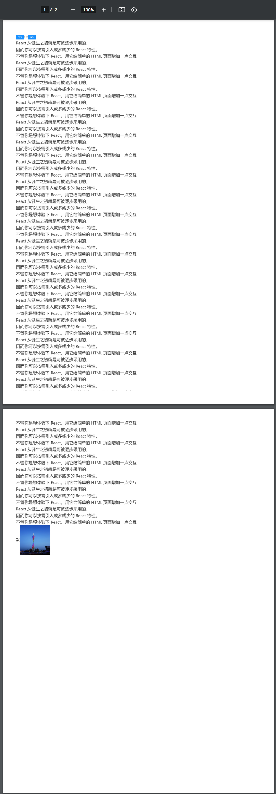

<!--
 * @Author: hft
 * @Date: 2021-11-23 11:30:12
 * @LastEditors: hft
 * @LastEditTime: 2021-11-25 15:58:26
 * @Description: file content
-->
## 前言

最近看到一个有趣的需求，主要是：

1. 将当前页面导出为图片
2. 将当前页下载为 pdf、A4 打印（页面要支持 A4 纸打印，页面有点长会有分页，注意要防止内容截断；页面要支持 pdf 导出，分页时注意要防止内容截断）

## 创建项目
 
```bash
 yarn create @umijs/umi-app
```
## 概述

本 demo 结合 `react`,`antd`，主要是想实现将页面的内容导出为 PNG,jpeg,svg,PDF。


## 使用项目

下载依赖

```bash
 yarn
```

运行

```bash
 yarn start
```

## 运行效果

主页：


<br/>

下载PDF显示效果：

